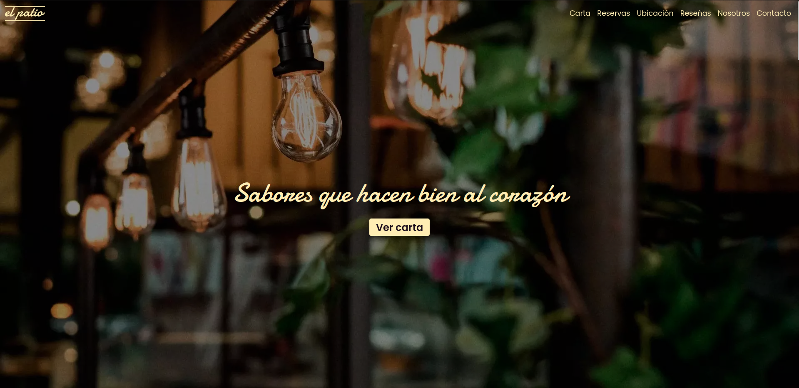
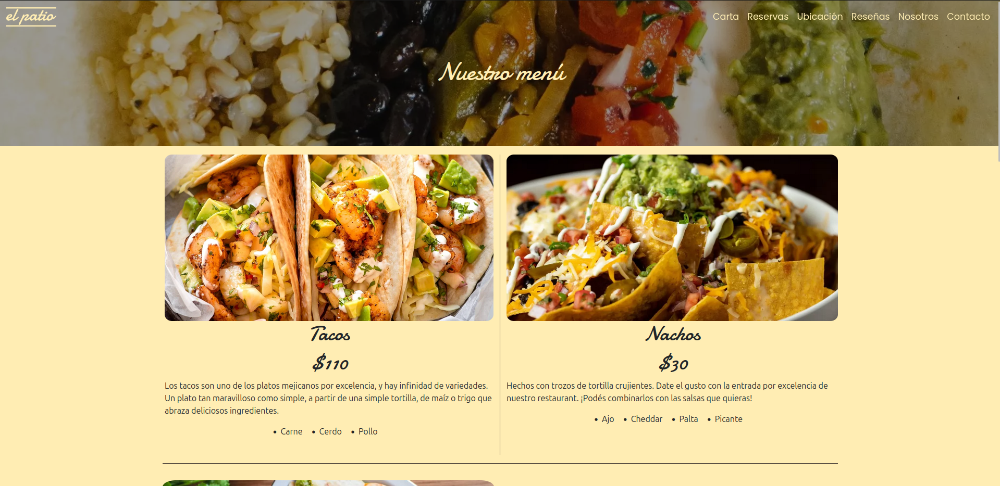
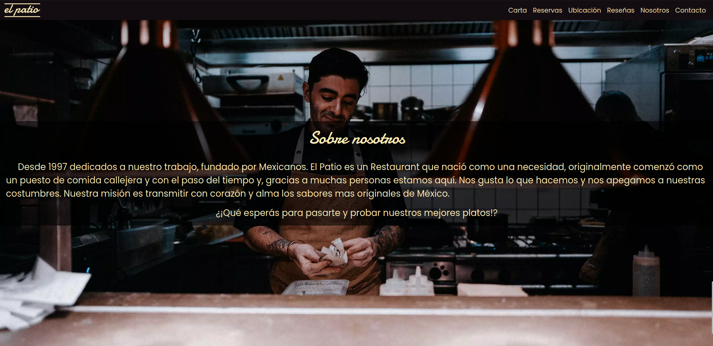

# El Patio - Restaurante Mexicano 🌮

## Descripción
El Patio es un sitio web para un restaurante mexicano ficticio, desarrollado como proyecto final para el curso de Desarrollo Web en CoderHouse. La página presenta un diseño responsive y moderno, permitiendo a los usuarios explorar el menú, hacer reservaciones y conocer más sobre el restaurante.

## 🚀 Demo
Visitá el sitio: [El Patio Restaurant](https://el-patio-restaurant.netlify.app/index.html)

## 📸 Capturas de Pantalla

## ⚙️ Tecnologías Utilizadas
- HTML5
- CSS3
- Bootstrap
- SASS
- JavaScript

## 🌟 Características
- Diseño responsive
- Menú interactivo
- Formulario de reservaciones
- Galería de imágenes
- Integración con redes sociales

## 🛠️ Instalación
1. Cloná este repositorio
git clone https://github.com/PabloEchegaray97/Proyecto-Final-CoderHouse.git
2. Abrí el archivo index.html en tu navegador

## 📝 Estructura del Proyecto
proyecto/
│
├── assets/
│   ├── images/
│   └── screenshots/
├── css/
│   └── styles.css
├── scss/
│   └── main.scss
├── js/
│   └── main.js
└── index.html

## 👤 Autor

Pablo Echegaray
- LinkedIn: [Pablo Echegaray](https://www.linkedin.com/in/pablo-echegaray-a4a000241/)

